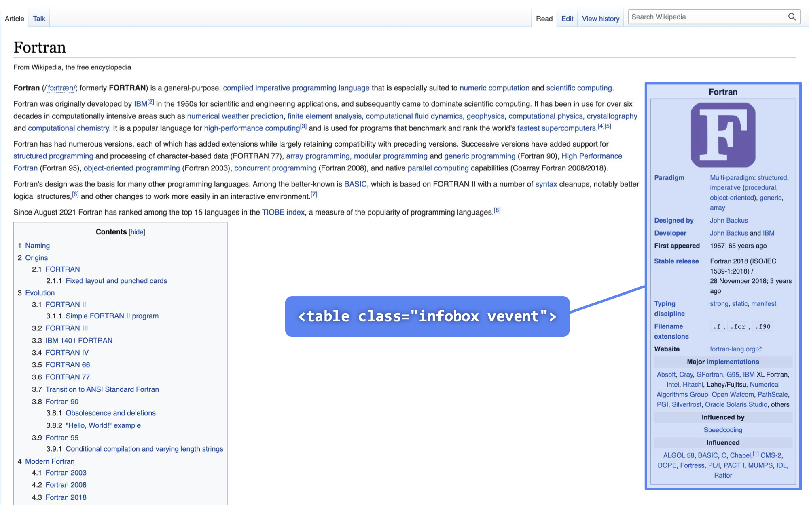
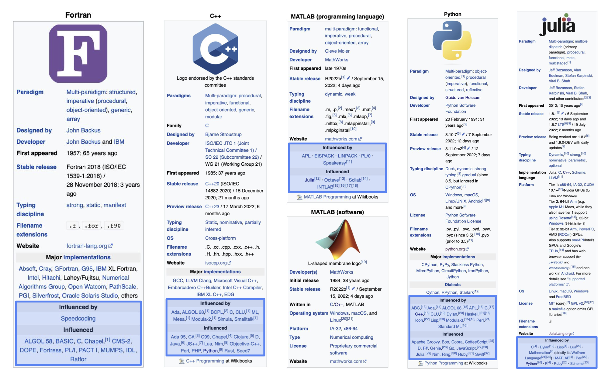
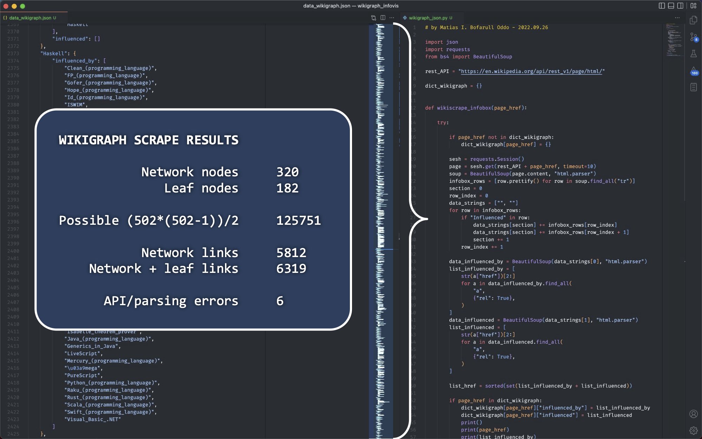

# wikigraph_infovis

A network infographic of programming languages (PLs) - this project explores how to create an all-at-once visualization of PLs, how they influence each other, and how they develop over time.

The data comes from Wikipedia, specifically from PL pages (.en) that have an "infobox" HTML tag, which has href links that can be recursively Python scraped to construct an adjacency matrix, which in turn translates into a graph. In this network graph ach unqiue PL is a node, and relationships between nodes is determined by how PLs relate to one another. Supplementary data can include year of introduction, programming paradigm, and typing discipline.

### Git Setup Cheatsheet

First download the repo through CLI and use `checkout -b` to create and name a new branch.

```
cd src
gh repo clone dirediredock/wikigraph_infovis
cd wikigraph_infovis
git status
git checkout -b desktop_edits
git status
```

When work of the day is complete, commit all changes on VS Code and `push`, then return to `main` for a fresh start next time.

```
git push
git push --set-upstream origin desktop_edits
git fetch origin main:main
git checkout main
```



