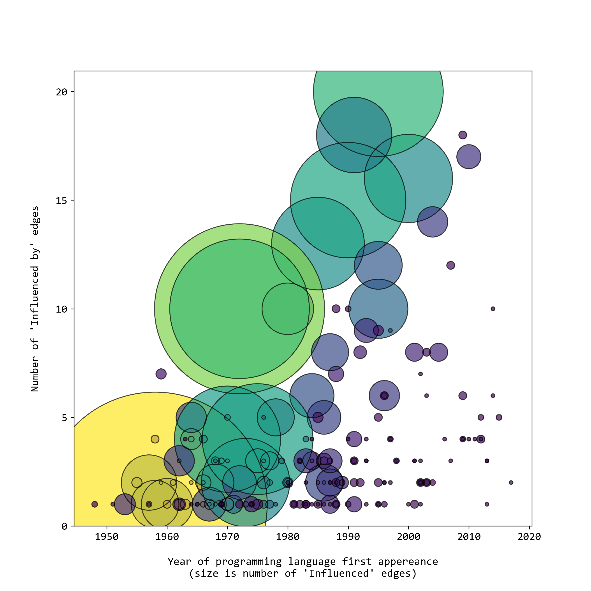
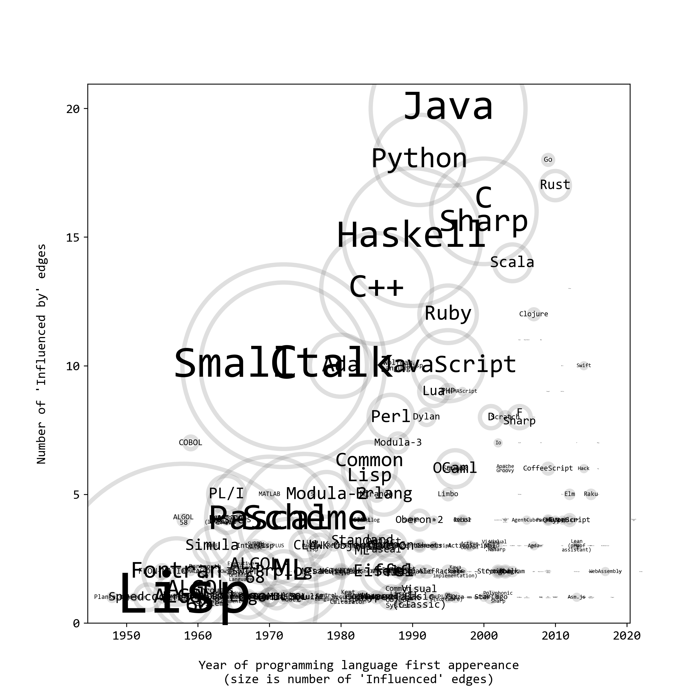

# wikigraph_infovis

This project is about a data-driven infographic of programming languages, a network graph visualization of how languages influence each other and develop over time. Project for 2022 CPSC547 (Information Visualization) at UBC.

The data comes from Wikipedia, specifically from English pages (.en) that have an "infobox" HTML tag, which has href links that can be recursively Python scraped to construct a network graph adjacency matrix. In this graph each unqiue PL is a node, and relationships between nodes is determined by how PLs influence one another. Supplementary data includes year of first appereance, and can be expanded to include programming paradigm and typing discipline, for example.

### Git Setup Cheatsheet

First download the repo through CLI and use `checkout -b` to create and name a new branch.

```
cd src
gh repo clone dirediredock/wikigraph_infovis
cd wikigraph_infovis
git status
git checkout -b desktop_edits
git status
```

When work of the day is complete, commit all changes on VS Code and `push`, then return to `main` for a fresh start next time.

```
git push
git push --set-upstream origin desktop_edits
git fetch origin main:main
git checkout main
```

## Data Exploration


- `wikigraph_export_json.py`
- The core dataset `data_wikigraph.json` was succedfully scraped on October 8th 2022.
- Each wikipedia page related to a programming language has an infobox that has three fields of interest, year of language first appereance, list of langages it influenced, and list of languages it was influenced by.
- This scraper uses Wikipedia's REST API and Python's BeautifulSoup to parse the HTML page content.
- Scraping starts with a given href and recursively crawls all other hrefs listed in the infobox of a page, until all hrefs are exhausted.
- When the recursive scraping is complete each unique href becomes a key in JSON file, with four subfields:
- `first_appeared` is the year
- `influenced` is a list of hrefs, the outgoing links in a graph
- `influenced_by` is a list of hrefs, the incoming links in a graph
- `redirect_href` is the encoded HTML redirect href
- `true_href` is the page href that resolves synonyms
- Data cleaning: removing `href` vestigial disambiguator string and duplicates, export node-to-node directed graph as CSV (each row is a unique graph edge)
- Metadata: isolate in dictionaries, then dataframe, then export as CSV




Forced directed network drawn with `pyvis.network` with `force_atlas_2based()`, on the right with MATLAB node and neighbors highlighted.

# Notes

- Tasky explainer, guided by "here is something that I'd like to know!"
- Try to think about tasks (highlight path, two-way influence nodes, year-sorted)
- Domain specific first, then abstract
- For this abstraction, there can be generalized - a more technique-y paper
- - node with mayor influence
- trace/centrality

What to do with nodes with missing year?

- We know the year must be larger than the smallest year of an incoming node
- We can calculate the average difference of node and subnode year difference to calculate a buffer year addition so that

- `unknown_year = min([list_incoming_node_years]) + year_buffer`

Maybe I can make the length of the edge realted to time?

- `edge_length = end_node_year - start_node_year`

Topology tasks

- Pick a node, highlight all paths incoming and outgoing from it
- Pick a node, highlight all the nodes just one hop away
- Shortest path between two nodes
- Are there bridge nodes between network clusters?
