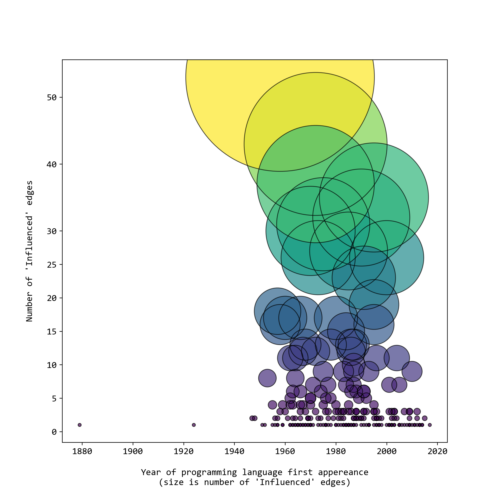
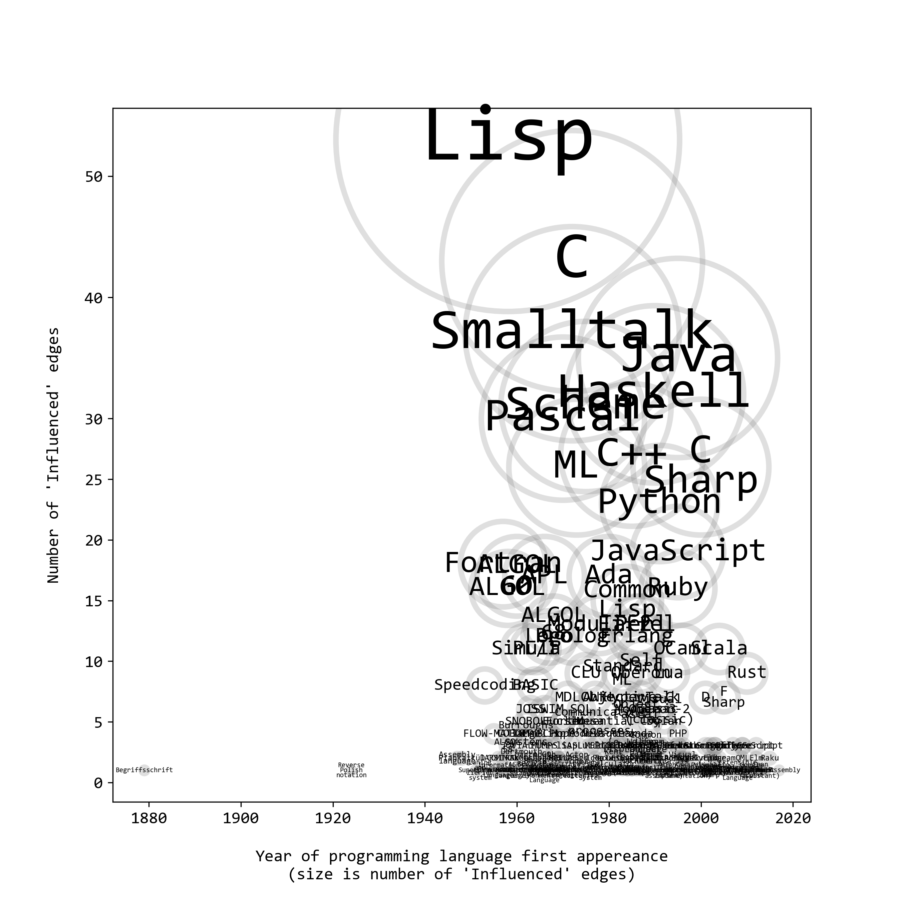

# wikigraph_infovis

This project is about a data-driven infographic of programming languages, a network graph visualization of how languages influence each other and develop over time. Project for 2022 CPSC547 (Information Visualization) at UBC.

The data comes from Wikipedia, specifically from English pages (.en) that have an "infobox" HTML tag, which has href links that can be recursively Python scraped to construct a network graph adjacency matrix. In this graph each unqiue PL is a node, and relationships between nodes is determined by how PLs influence one another. Supplementary data includes year of first appereance, and can be expanded to include programming paradigm and typing discipline, for example.

### Git Setup Cheatsheet

First download the repo through CLI and use `checkout -b` to create and name a new branch.

```
cd src
gh repo clone dirediredock/wikigraph_infovis
cd wikigraph_infovis
git status
git checkout -b desktop_edits
git status
```

When work of the day is complete, commit all changes on VS Code and `push`, then return to `main` for a fresh start next time.

```
git push
git push --set-upstream origin desktop_edits
git fetch origin main:main
git checkout main
```

## Data Exploration


- Data cleaning: removing `href` vestigial disambiguator string and duplicates, export node-to-node directed graph as CSV (each row is a unique graph edge)
- Metadata: isolate in dictionaries, then dataframe, then export as CSV





https://github.com/dirediredock/wikigraph_infovis/blob/main/figures/adjacency_matrix.pdf

http://profs.etsmtl.ca/mmcguffin/research/2012-mcguffin-simpleNetVis/mcguffin-2012-simpleNetVis.pdf

- Tasky explainer, guided by "here is something that I'd like to know!"
- Try to think about tasks (highlight path, two-way influence nodes, year-sorted)
- Domain specific first, then abstract
- For this abstraction, there can be generalized - a more technique-y paper
- - node with mayor influence
- trace/centrality

* Explorify - Spotify infovis class project (design study)
* RelEx - Research paper
* Bewilder - class paper, cautionary tale of engineering
* EdgeMaps - Technique paper
* Ishkur.com

- This edit was made on desktop to test if GitHub stuff is working.
